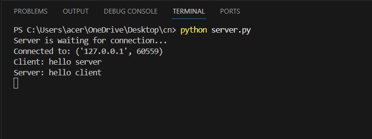
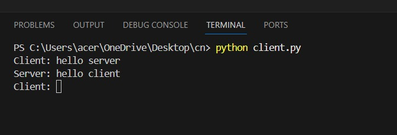
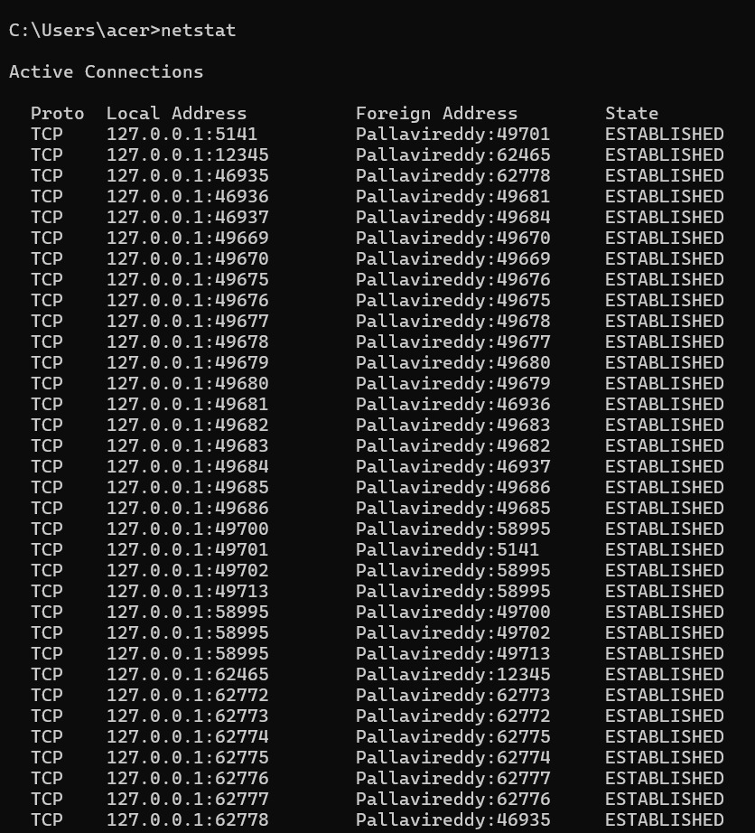
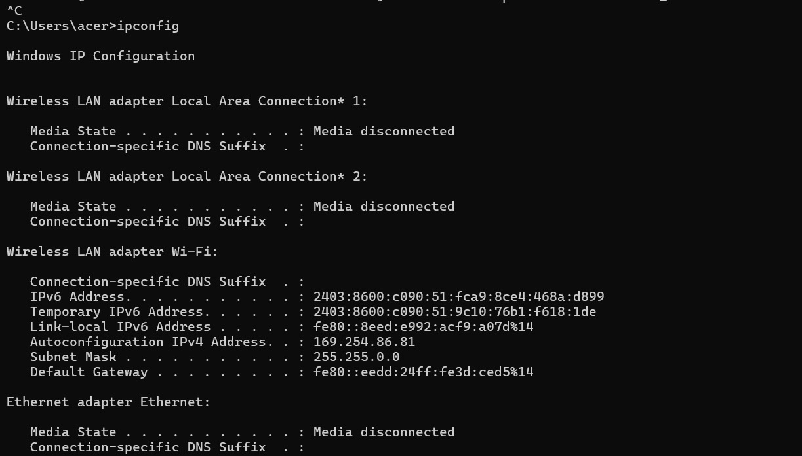
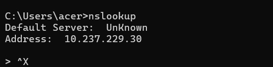
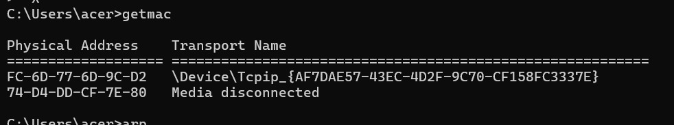
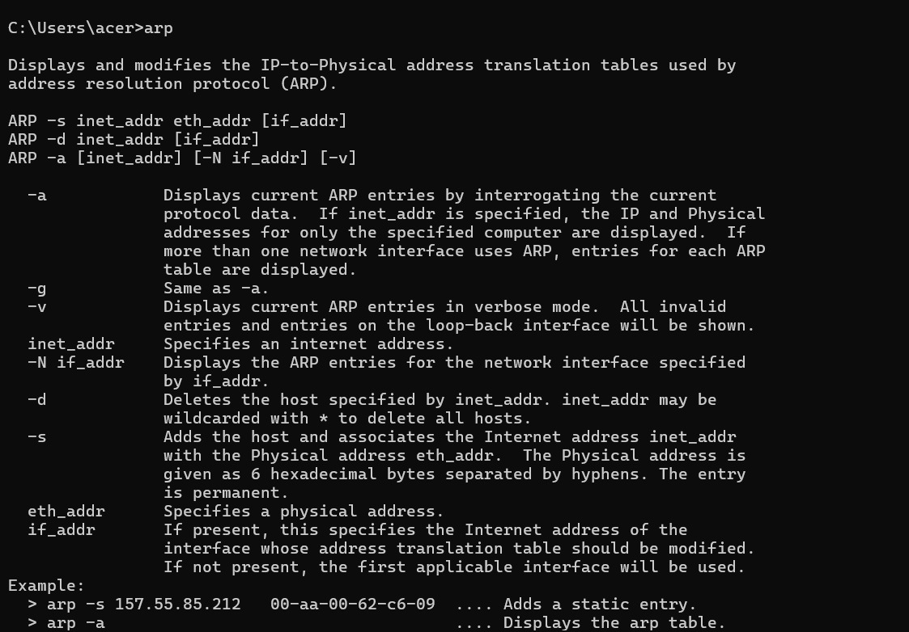
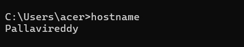
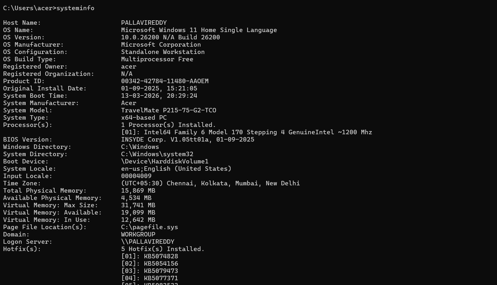

# 4.Execution_of_NetworkCommands
## AIM :Use of Network commands in Real Time environment
## Software : Command Prompt And Network Protocol Analyzer
## Procedure: To do this EXPERIMENT- follows these steps:
<BR>
In this EXPERIMENT- students have to understand basic networking commands e.g cpdump, netstat, ifconfig, nslookup ,traceroute and also Capture ping and traceroute PDUs using a network protocol analyzer 
<BR>
All commands related to Network configuration which includes how to switch to privilege mode
<BR>
and normal mode and how to configure router interface and how to save this configuration to
<BR>
flash memory or permanent memory.
<BR>
This commands includes
<BR>
• Configuring the Router commands
<BR>
• General Commands to configure network
<BR>
• Privileged Mode commands of a router 
<BR>
• Router Processes & Statistics
<BR>
• IP Commands
<BR>
• Other IP Commands e.g. show ip route etc.
<BR>

## Output

server.py
```
import socket

# Create socket
server_socket = socket.socket(socket.AF_INET, socket.SOCK_STREAM)

# Bind to localhost and port
host = "127.0.0.1"
port = 12345
server_socket.bind((host, port))

# Listen for connections
server_socket.listen(1)
print("Server is waiting for connection...")

conn, addr = server_socket.accept()
print("Connected by", addr)

while True:
    data = conn.recv(1024).decode()
    if not data:
        break
    
    print("Client:", data)
    
    message = input("Server: ")
    conn.send(message.encode())

conn.close()
```
client.py
```
import socket

# Create socket
client_socket = socket.socket(socket.AF_INET, socket.SOCK_STREAM)

host = "127.0.0.1"
port = 12345

# Connect to server
client_socket.connect((host, port))

while True:
    message = input("Client: ")
    client_socket.send(message.encode())
    
    data = client_socket.recv(1024).decode()
    print("Server:", data)

client_socket.close()
```


server.py
```
import socket

# Create server socket
server = socket.socket(socket.AF_INET, socket.SOCK_STREAM)

# Bind server to localhost and port
host = "127.0.0.1"
port = 12345
server.bind((host, port))

# Listen for client
server.listen(1)
print("Server is waiting for connection...")

conn, addr = server.accept()
print("Connected to:", addr)

while True:
    data = conn.recv(1024).decode()

    if not data:
        break

    print("Client:", data)

    message = input("Server: ")
    conn.send(message.encode())

conn.close()
```
client.py
```
import socket

# Create client socket
client = socket.socket(socket.AF_INET, socket.SOCK_STREAM)

# Server address
host = "127.0.0.1"
port = 12345

# Connect to server
client.connect((host, port))

while True:
    message = input("Client: ")
    client.send(message.encode())

    data = client.recv(1024).decode()
    print("Server:", data)

client.close()
```









## Result
Thus Execution of Network commands Performed 
